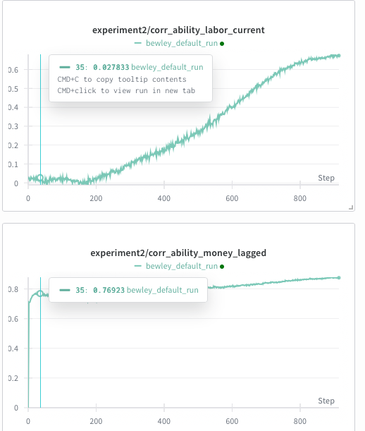
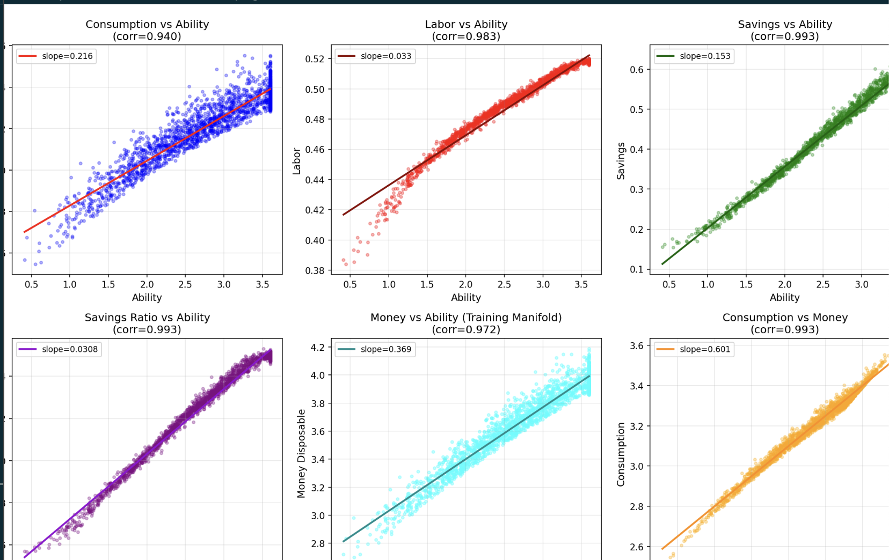

# Diagnostic Analysis: Counterintuitive Decision Rules

## Problem Summary

The trained policy exhibits economically counterintuitive behavior when visualizing decision rules by varying ability:

- **As ability increases (0 → 5):**
  - Consumption **DECREASES** (3.55 → 3.15) ❌ Should increase
  - Labor **INCREASES** (0.38 → 0.52) ⚠️ Could be correct (substitution effect)
  - Savings (absolute) **INCREASES** (0.21 → 0.61) ⚠️ Could be correct
  - Savings ratio **INCREASES** (0.055 → 0.16) ❌ Too steep, counterintuitive

**Expected behavior:** Higher ability agents should consume MORE due to higher income (wealth effect dominates in Bewley models).

---

## Issue #1: Normalizer with EMA "Forgets" Distribution ⚠️ HIGH PRIORITY

### Location
`src/normalizer.py:206-231`

### Description
The normalizer uses Exponential Moving Average (EMA) with **momentum=0.99**, which is extremely slow to adapt:

```python
# Line 223-227
alpha = 1.0 - self.momentum  # alpha = 0.01 for momentum=0.99
s.mean = self.momentum * s.mean + alpha * mean_b  # 99% old, 1% new
s.M2 = self.momentum * s.M2 + alpha * M2_b
```

### Why This Causes Problems

1. **Distribution Shift During Training:**
   - As agents learn better policies, their wealth distribution changes
   - High-ability agents accumulate more `money_disposable` over time
   - The normalizer statistics LAG behind the true distribution

2. **Feedback Loop:**
   ```
   Training iteration t:
   → Agents save more → money_disposable drifts upward
   → Normalizer mean is still at old (lower) value
   → New high values get normalized to LARGE positive values
   → Network learns: "large normalized money → high ability → save even more"
   → Reinforces the drift
   ```

3. **Count Capping:**
   ```python
   # Line 231
   s.count = torch.clamp(s.count + 1, max=1000.0)
   ```
   After 1000 steps, the count stops growing, but EMA continues with momentum=0.99. This means the normalizer is designed to "forget" old statistics, but too slowly.

### Evidence This Is The Problem

- The normalized values depend on training history, not current economic fundamentals
- Different training runs would learn different spurious correlations
- Visualization uses `update_normalizer=False`, so it uses frozen (potentially stale) statistics

### Economic Interpretation

The network might have learned: "If normalized_money is high (relative to lagging normalizer mean), you must be a high-ability agent who has been accumulating wealth, so keep saving aggressively."

---

## Issue #2: Initialization Lacks Economic Structure ⚠️ MODERATE PRIORITY

### Location
`src/train.py:45-56`

### Description
Initial states are sampled **independently** without economic correlations:

```python
# Line 45-46
moneydisposable = np.random.lognormal(0.1, 2.0, batch_size * n_agents)
savings = np.random.lognormal(0.1, 2.0, batch_size * n_agents)

# Line 48-56
ability = np.random.lognormal(ability_log_mean, ability_log_std, ...)
```

### Why This Causes Problems

1. **No Ability-Wealth Correlation:**
   - In reality, high-ability agents should have accumulated more wealth (in steady state)
   - Starting with uncorrelated states means the network must learn from scratch
   - Early training explores economically implausible state space

2. **Poor Exploration:**
   - If training is short (100 steps in baseline config), the network may only learn behavior near initialization
   - The network might learn: "ability and wealth are independent" as a prior

3. **Lognormal Parameters:**
   ```python
   moneydisposable = np.random.lognormal(0.1, 2.0, ...)  # mean ≈ 1.22, std ≈ 2.58
   ability_log_mean = np.log(5)  # ≈ 1.61
   ability_log_std = sigma_v / np.sqrt(1 - rho_v**2)  # ≈ 0.64
   ```
   The money distribution has huge variance (std/mean ≈ 2.1), which might make learning unstable.

### Suggested Fix Direction

Initialize with economic consistency:
- High ability → High initial wealth
- Use steady-state approximation: `money_disposable ∝ ability^α` for some α

---

## Issue #2A: Poor Exploration of High-Income States ⚠️ VERY HIGH PRIORITY

### Location
Training loop in `src/train.py` and initialization in `src/train.py:45-56`

### Description
**Critical insight from user:** During training, the agent may never visit high-income states, so it never learns proper behavior in those regions.

### The Mechanism

1. **Initial Distribution is Concentrated:**
   ```python
   # train.py:45
   moneydisposable = np.random.lognormal(0.1, 2.0, ...)
   # This gives: mean ≈ 1.22, median ≈ 0.74
   # Most samples are in range [0.3, 3.0]
   ```

2. **Training May Not Explore Higher States:**
   - Training is only 100 steps (baseline config)
   - If agents' policies don't naturally lead to high wealth accumulation
   - Or if they do, but slowly (need 1000+ steps to reach steady state)
   - Then training data is concentrated in `money_disposable ∈ [0.5, 3.0]`

3. **Visualization Asks About Unseen States:**
   - When varying ability to 5.0, economically the agent should have high money (e.g., 10+)
   - But if training never saw `money > 3.0`, the network has no data there
   - Network's behavior in unseen regions is **arbitrary extrapolation**

### Why This Explains The Counterintuitive Pattern

```
Training experience:
  - Mostly see: ability ∈ [3, 7], money ∈ [0.5, 3.0]
  - Learn proper policies in this region

Visualization queries:
  - ability = 5.0, money = 1.5 (from checkpoint state)

Problem:
  - If ability=5.0 agents should have money=10 in steady state
  - But network never saw money=10 during training
  - Network extrapolates: "ability=5, money=1.5 → I'm poor relative to my ability → SAVE!"
  - This is actually rational IF the network thinks it's off steady-state
```

### Compounding Effect with Normalizer Issue

This makes Issue #1 even worse:

```
Training visits: money ∈ [0.5, 3.0]
→ Normalizer learns: mean ≈ 1.5, std ≈ 0.8

Visualization: ability=5, money=1.5
→ normalized_money ≈ 0.0 (close to training mean)
→ But ability=5 should correspond to money=10 (never seen!)
→ normalized_money for 10 would be ≈ 10.6 (way out of distribution)
→ Network was never trained on normalized values > 2.0
→ Arbitrary behavior when extrapolating
```

### Evidence This Is The Problem

Need to check:
1. **State coverage during training:** What is the range of `money_disposable` visited?
2. **Steady-state values:** What should `money_disposable` be for ability=5 in equilibrium?
3. **Visualization range:** Are you querying states far outside training distribution?

### Diagnostic Questions

1. **How long did you train?** (100 steps is very short for reaching steady state)
2. **What is the final distribution of money_disposable in your checkpoint state?**
3. **Did money_disposable increase during training, or stay near initialization?**
4. **What is the theoretical steady-state wealth for ability=5 in your model?**

---

## Issue #3: Visualization Doesn't Match Training Distribution ⚠️ HIGH PRIORITY

### Location
`vis_dc_rle.py:256-279`

### Description
When creating decision rule plots, you vary ONE variable while holding others **constant**:

```python
# Line 271-275
attr_tensor[batch_idx, agent_idx] = torch.tensor(value, ...)
# Only this ONE agent's ONE attribute changes
```

### Why This Causes Problems

**Critical insight:** During training, high-ability agents naturally accumulate MORE wealth through equilibrium dynamics. But visualization asks: **"What should a high-ability agent do with LOW/AVERAGE money?"**

The network's answer might be economically rational:
```
High ability + Low money = "I'm behind where I should be → SAVE AGGRESSIVELY"
High ability + High money = "I'm where I should be → normal savings"
```

### Experiment to Test This

Check correlation in trained state:
```python
# After training
correlation = np.corrcoef(state.moneydisposable.flatten(), state.ability.flatten())
```

If correlation > 0.3, then varying ability while fixing money is **off-distribution**.

### Suggested Fix

Create a "conditional visualization":
1. Vary ability from 0 to 5
2. For each ability value, set `money_disposable = f(ability)` where `f` matches the training correlation
3. This shows decision rules on the actual training manifold

---

## Issue #4: Feature Construction - Information Leakage ⚠️ LOW PRIORITY

### Location
`src/utils/buildipnuts.py:19-26`

### Description
Each agent observes **ALL** agents' states:

```python
# Line 19-20
sum_info = torch.cat([moneydisposable, ability], dim=1)  # (B, 2A)
sum_info_rep = sum_info.unsqueeze(1).expand(-1, A, -1)  # Broadcast to all agents
```

This means agent `i` sees:
- `[money_0, money_1, ..., money_A, ability_0, ability_1, ..., ability_A]`
- Plus its own `[money_i, ability_i]`

### Why This Might Cause Issues

1. **Redundant Information:** Agent i's own state appears twice (in aggregate and individual)
2. **Confusing Signals:** The network must learn to disentangle:
   - "My own ability" vs "Average ability in my batch"
   - "My relative position" vs "Absolute values"

3. **Batch Artifacts:** Different batches have different aggregate statistics, which could create spurious patterns

### Impact Assessment

Probably **not** the main cause, but could add noise to learning.

---

## Issue #5: Normalizer Not Updated on Parallel Branches ⚠️ LOW PRIORITY

### Location
`src/environment.py:577-587`

### Description
During training, the normalizer is updated differently for main vs parallel states:

```python
# Line 557-561: Main state - UPDATE normalizer
temp_state = self.create_temporary_state(
    main_state=main_state,
    policy_net=policy_net,
    update_normalizer=True  # ← Updates statistics
)

# Line 577-587: Parallel branches - DON'T update
parallel_A, outcomes_A = self.compute_parallel_outcomes(
    parallel_state=parallel_A,
    policy_net=policy_net,
    update_normalizer=False  # ← Doesn't update
)
```

### Why This Might Cause Issues

1. **Asymmetric Statistics:**
   - Normalizer only "sees" the committed branch
   - The other branch's states are evaluated but not recorded
   - If parallel branches explore different parts of state space, normalizer is blind to them

2. **Distribution Mismatch:**
   - After shocks, ability changes: `ability[t+1] ≠ ability[t]`
   - Parallel branches have different ability distributions than main state
   - Normalizer statistics don't reflect this

### Impact Assessment

Minor issue - parallel branches are evaluated, just not used for statistics. Could cause slight inconsistency.

---

## Issue #6: Typo in Normalizer Key ⚠️ DOCUMENTATION

### Location
`src/environment.py:77`

### Description
```python
# Line 77
moneydisposable_normalized = self.normalizer.transform("moneydisposalbe", ...)
#                                                                    ^^^
#                                                                    Missing 'l'
```

This creates a normalizer entry with key `"moneydisposalbe"` instead of `"moneydisposable"`.

### Impact
Doesn't cause a bug (string keys are arbitrary), but makes debugging harder.

---

## Issue #7: No Wealth Effect in Model? 🤔 THEORETICAL QUESTION

### Location
Loss functions in `src/calloss.py`

### Description
The three losses enforce:
1. **FB Loss:** Complementarity between savings ratio and multiplier
2. **Euler Equation:** Intertemporal consumption smoothing
3. **Labor FOC:** Labor-consumption tradeoff

### Question
Is the model capable of learning wealth effects?

In standard Bewley models:
- Higher permanent income → Higher consumption (wealth effect)
- Higher wages → Could increase or decrease labor (income vs substitution effects)

But your model has:
- AR(1) ability shocks (persistent but mean-reverting)
- No explicit "permanent income" state variable
- Network must learn to infer persistence from ability history

### Hypothesis
If the network doesn't properly account for ability persistence, it might treat high ability as "temporary windfall" → save it all rather than consume.

---

## Issue #8: Loss Function Numerical Issues ⚠️ LOW PRIORITY

### Location
`src/calloss.py:187-240`

### Description
Multiple safe_pow operations with clipping:

```python
# Line 239-240
def _safe_pow(self, base, exp):
    base = torch.clamp(torch.abs(base / self.scale), min=self.eps, max=self.clip_val)
    return torch.exp(exp * torch.log(base + self.eps))
```

### Potential Issues

1. **Clipping Changes Gradients:**
   - When values hit clip bounds, gradients become zero
   - Network might get "stuck" at clipped regions

2. **Sign Loss:**
   - `torch.abs(base / self.scale)` removes sign information
   - Could cause issues if negative values are meaningful

3. **Loss Saturation:**
   ```python
   # Line 269
   loss_foc = torch.nan_to_num(loss_foc, nan=0.0, posinf=clip_val, neginf=-clip_val)
   ```
   Inf values are clamped, which could hide violations of FOCs

---

## Summary of Hypotheses Ranked by Likelihood

| Rank | Issue | Likelihood | Impact | Difficulty to Fix |
|------|-------|------------|--------|-------------------|
| 1 | Poor exploration of high-income states (Issue #2A) | ⭐⭐⭐⭐⭐ | Very High | Medium |
| 2 | Normalizer EMA drift (Issue #1) | ⭐⭐⭐⭐⭐ | High | Easy |
| 3 | Visualization off-distribution (Issue #3) | ⭐⭐⭐⭐⭐ | High | Easy |
| 4 | Initialization no correlation (Issue #2) | ⭐⭐⭐ | Medium | Medium |
| 5 | No wealth effect learned (Issue #7) | ⭐⭐⭐ | High | Hard |
| 6 | Parallel branch normalizer (Issue #5) | ⭐⭐ | Low | Easy |
| 7 | Feature redundancy (Issue #4) | ⭐ | Low | Medium |
| 8 | Loss clipping artifacts (Issue #8) | ⭐ | Low | Medium |

**Note:** Issues #2A, #1, and #3 are likely **compounding** - they reinforce each other:
- Poor exploration → Limited state coverage → Normalizer learns narrow distribution → Visualization queries out-of-distribution states

---

## Recommended Diagnostic Experiments

### Experiment 0: Check State Space Coverage During Training ⭐ **DO THIS FIRST**

**Goal:** Determine what range of states the network actually trained on

**Method:**
1. Load checkpoint at final step
2. Compute statistics on `state.moneydisposable` and `state.ability`
3. Plot histograms
4. Compare to visualization range

**Expected Result if Issue #2A is the problem:**
```python
# Training data
money_disposable: mean=1.5, std=0.8, range=[0.2, 4.0]
ability: mean=5.0, std=0.6, range=[3.5, 7.0]

# Visualization queries
ability=5.0, money=1.5  # This is IN distribution
ability=0.5, money=1.5  # This is OUT of distribution (never saw ability < 3.5)

# But economic steady state should be:
ability=5.0 → money≈10  # Never saw money > 4!
```

**Implementation:**
```python
# Load checkpoint
state = torch.load("checkpoints/run_name/states/state_step_100.pt")

# Analyze
money = state.moneydisposable.cpu().numpy().flatten()
ability = state.ability.cpu().numpy().flatten()

print(f"Money: min={money.min():.2f}, max={money.max():.2f}, "
      f"mean={money.mean():.2f}, std={money.std():.2f}")
print(f"Ability: min={ability.min():.2f}, max={ability.max():.2f}, "
      f"mean={ability.mean():.2f}, std={ability.std():.2f}")

# Plot
import matplotlib.pyplot as plt
fig, axes = plt.subplots(1, 2, figsize=(12, 4))
axes[0].hist(money, bins=50)
axes[0].set_title("Training Distribution: money_disposable")
axes[1].hist(ability, bins=50)
axes[1].set_title("Training Distribution: ability")
plt.savefig("training_state_coverage.png")
```

---

### Experiment 1: Check Normalizer Statistics vs Reality

**Goal:** Determine if normalizer statistics match current data distribution

**Method:**
1. Load checkpoint at step N
2. Extract normalizer statistics: `normalizer._stats["moneydisposalbe"].mean`
3. Extract actual state statistics: `state.moneydisposable.mean()`
4. Compare and check for large discrepancies

**Expected Result if Issue #1 is the problem:**
- Normalizer mean < Actual mean (lagging behind)
- Normalizer std < Actual std (underestimating variance)

---

### Experiment 2: Check Ability-Wealth Correlation in Trained State

**Goal:** Determine if high-ability agents have more wealth in trained states

**Method:**
```python
corr = np.corrcoef(state.moneydisposable.flatten(), state.ability.flatten())[0, 1]
```

**Expected Result if Issue #3 is the problem:**
- Correlation > 0.3: Strong positive correlation
- Visualization with fixed money is off-distribution

---

### Experiment 3: Visualize with Correlated Variables

**Goal:** Show decision rules on the training manifold

**Method:**
1. Fit linear regression: `money = α + β * ability` on training state
2. Create visualization grid: vary ability, set `money = α + β * ability`
3. Plot decision rules

**Expected Result if Issue #3 is the problem:**
- Consumption should INCREASE with ability
- Savings ratio should be more stable

---

### Experiment 4: Test Normalizer Sensitivity

**Goal:** Check if decision rules change when normalizer statistics change

**Method:**
1. Load checkpoint
2. Manually perturb normalizer statistics: `normalizer._stats["moneydisposalbe"].mean *= 1.1`
3. Re-run visualization
4. Compare decision rules

**Expected Result if Issue #1 is the problem:**
- Decision rules change significantly
- Different normalizer stats → different behavior (should not happen!)

---

### Experiment 5: Train Longer and Check Convergence

**Goal:** Test if longer training allows exploration of high-income states

**Method:**
1. Train for 10,000 steps (100x longer than baseline)
2. Monitor state statistics every 100 steps
3. Check if `money_disposable` distribution expands over time
4. Re-visualize decision rules

**Expected Result if Issue #2A is the problem:**
- Longer training → More exploration → Better decision rules
- State distribution should expand to higher values

---

### Experiment 6: Check Network Input-Output on Grid

**Goal:** Understand what the network has actually learned

**Method:**
For a grid of `(money_disposable, ability)` pairs:
1. Compute normalized inputs
2. Feed through network
3. Plot heatmap of `savings_ratio(money, ability)`

**Expected Result:**
- Should reveal if network has learned: "high ability + low money → save more"
- Can identify if the spurious pattern is in network weights or normalization

---

## Questions for Discussion

1. **What is the range of money_disposable in your trained states?**
   - If max < 5, then you never explored high-income regions
   - Issue #2A is definitely the problem

2. **How long did you train?**
   - 100 steps (baseline) → Probably stuck near initialization
   - 1000+ steps → Might have reached steady state

3. **What is the correlation between ability and money_disposable in your trained states?**
   - If high (> 0.3), then Issue #3 is definitely a problem

4. **Did you monitor state statistics during training?**
   - Did money_disposable increase over time?
   - Or stay constant around initialization values?

5. **What should the steady-state wealth be for ability=5?**
   - Need to compute economic equilibrium
   - Compare to what network actually sees

6. **Did you monitor normalizer statistics during training?**
   - Were they stable or drifting?

7. **What do the loss curves look like?**
   - Are FOC losses converging to near-zero?
   - Or are they stuck at some positive value (suggesting constraints bind)?

---

## Conclusion

The most likely culprits are **THREE COMPOUNDING ISSUES**:

1. **Poor exploration (Issue #2A):** Training only visits low-income states, never learns high-income behavior

2. **Normalizer drift (Issue #1):** EMA with momentum=0.99 creates spurious correlations between normalized features and decisions

3. **Off-distribution visualization (Issue #3):** Varying ability while fixing money doesn't match training distribution where high-ability → high-money

**Recommended priority:**
1. Run **Experiment 0** first (5 minutes) - check training state coverage
2. Then **Experiment 2** (1 minute) - check ability-wealth correlation
3. Then **Experiment 3** (10 minutes) - re-visualize with correlated variables

This will immediately reveal if the issue is exploration vs normalization vs visualization methodology.
---

## Experiment Results
###  1. Normalzier dispersion with real state 
Results: Statistics consistent with the state, rule out assumption of the adapting issue for the normalizer

### 2. ability-wealth correlation
Results: Correlation between ability and wealth increase by time implies Agents are learning to accumulate wealth based on ability. Indicating the possibility of low exploration in early environment



### 3. wrong env state
Results: The labor still increases with the ability, after visulizing the transition. 

